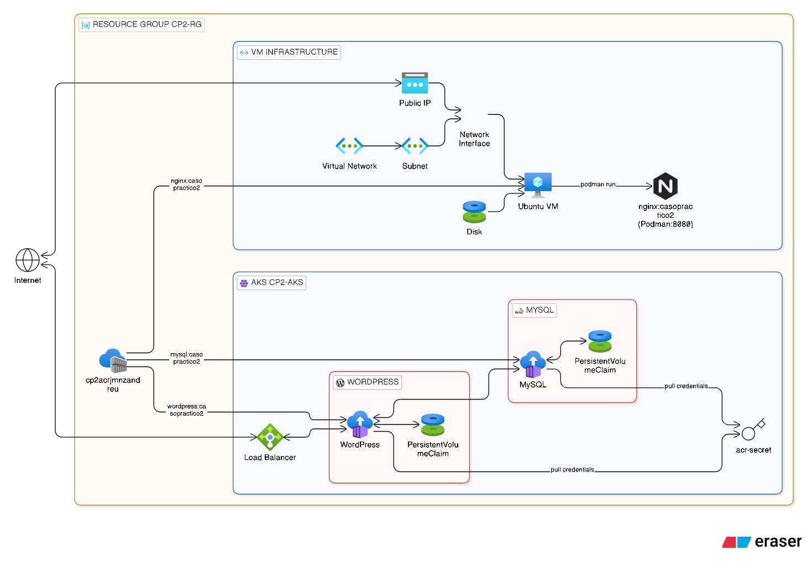
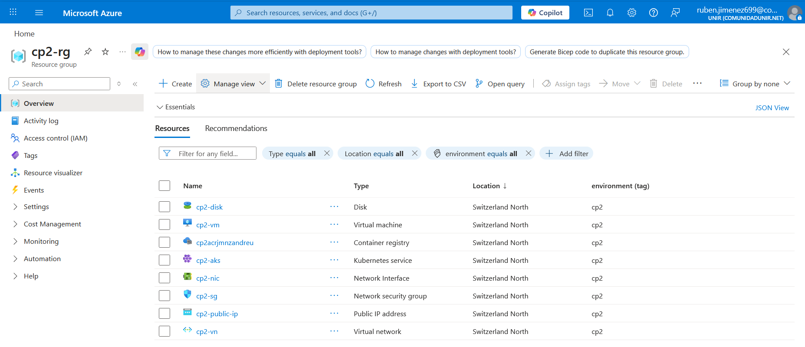
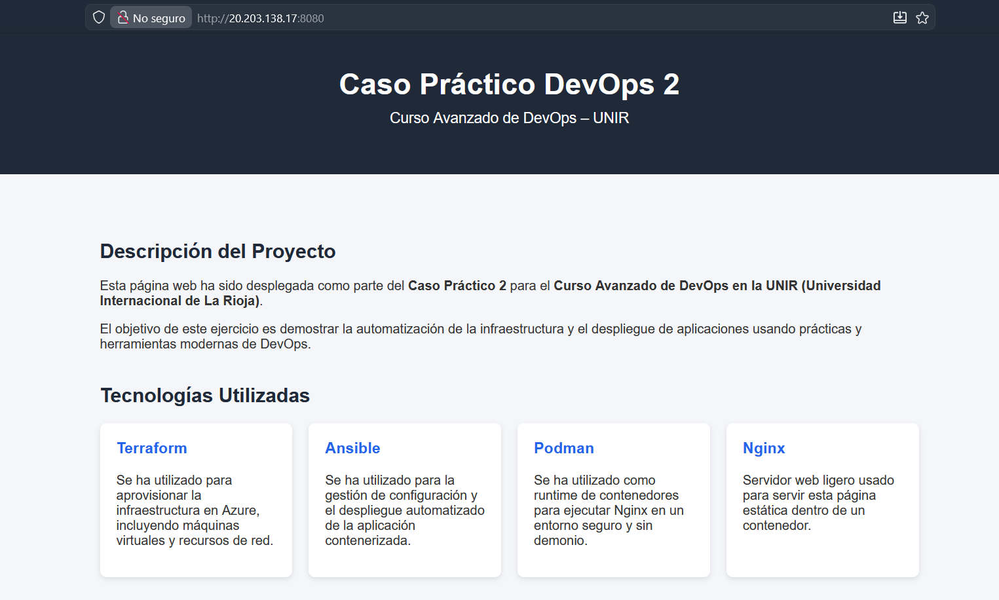

# Caso Práctico 2 - Curso Avanzado de DevOps (UNIR)

Este proyecto despliega en **Azure** una arquitectura completa que incluye:
- un **Azure Container Registry (ACR)** para almacenar imágenes,
- una **máquina virtual (VM)** para ejecutar contenedores con **Podman** y desplegar un **Nginx** con un *index.html* personalizado,
- y un clúster **AKS (Kubernetes)** que ejecuta una aplicación WordPress + MySQL.

La arquitectura se crea con **Terraform** y el despliegue servicios con **Ansible**.

Este repositorio corresponde al **Caso Práctico 2** del **Curso Avanzado de DevOps** de la **UNIR**.



## 🧩 Tecnologías utilizadas

- **Terraform** (infraestructura como código). Provisiona recursos en **Azure**.
- **Ansible** (configuración y orquestación). Configura la VM y despliega aplicaciones en Kubernetes.
- **Podman** (contenerización en la VM). Se usa en la máquina virtual para construir/ejecutar contenedores.
- **Azure** (cloud provider). Se crea:
  - Un **grupo de recursos**
  - Una **VM Linux** con acceso SSH
  - Un **Azure Container Registry (ACR)**
  - Un **AKS (Azure Kubernetes Service)**
- **Kubernetes** (AKS). Se despliega un clúster que hospeda aplicaciones (WordPress + MySQL).

## 🗂 Estructura principal del repositorio

- `terraform/` → Código Terraform para crear infraestructura en Azure.
- `ansible/` → Playbook e inventario dinámico para configurar VM, ACR y AKS.
- `Makefile` → Atajos para ejecutar despliegues y comandos comunes.
- `requirement.txt` → Librerías para el entorno virtual de Python necesarios para el despliegue de Kubernetes.

## ✅ Requisitos previos

- Tener instalado:
  - `az` (Azure CLI)
  - `terraform` (>= 1.x)
  - `ansible` (>= 2.9)
  - `podman` (en la VM se instala automáticamente via Ansible)
  - `python3` y `pip` (para dependencias de Ansible/k8s)

## Configurar Azure en local

1. Inicia sesión en Azure:

```bash
az login
```

2. (Opcional) Selecciona la suscripción adecuada si se tienen varias:

```bash
az account set --subscription "<TU_SUBSCRIPCION>"
```

## Despliegue automatizado
Desde el directorio raíz se puede ejecutar el comando para ejecutar de forma automatizada el proceso de despliegue:

```bash
make full-deploy
```
> ⚠️ Si no existe el fichero `ansible/.vault_pass` se preguntará por la contraseña para desencriptar `ansible/group_vars/all.yml` donde se almacenan las contraseñas de mysql. La contraseña se proveerá en el documento de resolución del ejercicio.

Este comando realiza los siguientes pasos:

1. Crea el fichero `ansible/.vault_pass` si no existe.
2. Crear el entorno virtual de python `.venv` e instala las librerías de `requirements.txt`
3. Inicia terraform en el directorio `terraform`.
4. Guarda el subscription id de Azure en `terraform/terraform.tfvars` para conectase durante el despliegue. 
5. Despliega la infraestructura de terraform con `--auto-approve`.
6. Extrae vm_private_key de los outputs de Terraform y lo guarda en `ssh/id_rsa` para poder conectarse a la máquina virtual creada.
7. Ejecuta el playbook de ansible para realizar las siguientes tareas:
   1. Subir las imágenes de `nginx`, `mysql` y `wordpress` al ACR creado con Terraform con el tag `casopractico2`.
   2. Instalar Podman en la VM creada con Terraform y desplegar un container de `nginx` con un `index.html` personalizado.
   3. Desplegar `mysql` y `wordpress` en AKS creado con Terraform.

Finalizado, se puede eliminar la infrastructura creada con Terraform con:

```bash
make tf-destroy
```

Pueden consultarse todos los atajos con 
```bash
make help
```

## Resultados

### Infraestructura de Azure

Captura de los recursos desplegados en Azure con Terraform:



Por limitaciones de la subscripción de estudiantes, los recusrsos se han desplegado en la región *Switzerland North*. Todos están dentro del grupo de recursos **cp-rg** y tienen el tag **environment=cp2**.

### Nginx en Máquina Virtual


En los logs del despliegue se muestra la url para conectarse al Nginx de la máquina virtual. 
También se puede obtener la IP con:
```bash
cd terraform
terraform output vm_ip
```
y entrando en la URL:
```
http:\\<IP DE LA MAQUINA VIRTUAL>:8080
```

### WordPress en AKS


En los logs del despliegue se muestra la url para conectarse al WodPress en AKS a través del LoadBalancer. También se puede obtener la IP con:

```bash
az aks get-credentials --resource-group cp2-rg --name cp2-aks --overwrite-existing
kubectl get svc wordpress -n casopractico2 -o jsonpath='{.status.loadBalancer.ingress[0].ip}'
```
y entrando en la URL:
```
http:\\<IP DEL LOAD BALANCER>:8080
```